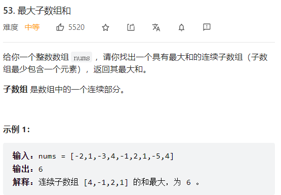
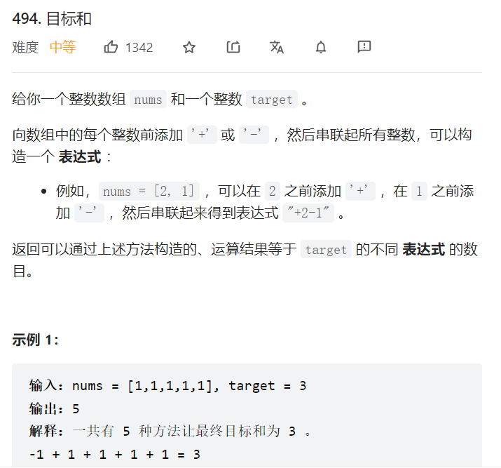
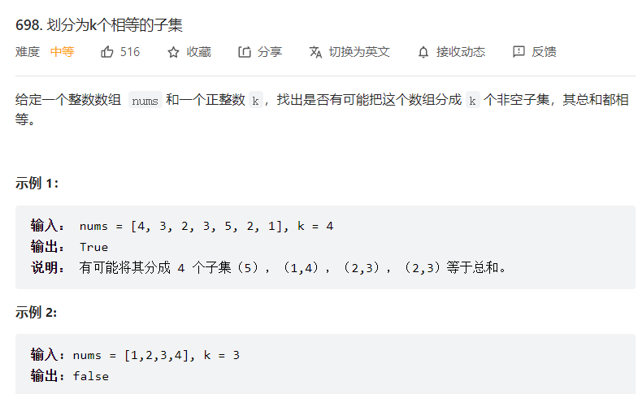

<!-- TOC -->

- [**codeHub**](#codehub)
  - [**高级数据结构**](#高级数据结构)
    - [**并查集**](#并查集)
      - [**leetcode 1697 检查边长限制的路径是否存在**](#leetcode-1697-检查边长限制的路径是否存在)
  - [**二叉树**](#二叉树)
    - [**leetcode 450 删除二叉搜索树的节点**](#leetcode-450-删除二叉搜索树的节点)
    - [**leetcode 236 最近公共祖先**](#leetcode-236-最近公共祖先)
    - [**leetcode T617合并二叉树**](#leetcode-t617合并二叉树)
    - [**leetcode T257 二叉树的所有路径**](#leetcode-t257-二叉树的所有路径)
    - [**leetcode110 判断是否为平衡二叉树**](#leetcode110-判断是否为平衡二叉树)
    - [**leetcode222 求完全二叉树的节点个数**](#leetcode222-求完全二叉树的节点个数)
  - [**超级经典**](#超级经典)
    - [**leetcode 24. 两两交换链表中的节点**](#leetcode-24-两两交换链表中的节点)
    - [**表达式求值**](#表达式求值)
  - [**边界问题**](#边界问题)
    - [**重新格式化字符串**](#重新格式化字符串)
  - [**图算法**](#图算法)
    - [**跳跃游戏四：可以跳到左右两格，或者任意值相等格**](#跳跃游戏四可以跳到左右两格或者任意值相等格)
    - [**跳跃游戏VII**](#跳跃游戏vii)
  - [**动态规划**](#动态规划)
    - [**leetcode 53 最大子数组和**](#leetcode-53-最大子数组和)
    - [**HJ75两字符串的最长公共子串**](#hj75两字符串的最长公共子串)
    - [**leetcode 1143 最长公共子序列**](#leetcode-1143-最长公共子序列)
    - [**编辑距离**](#编辑距离)
    - [**目标和**](#目标和)
    - [**最后一块石头的重量**](#最后一块石头的重量)
    - [**分割等和子集**](#分割等和子集)
    - [**跳跃游戏VII**](#跳跃游戏vii-1)
    - [**股票问题2：可以多次买入迈出，但是买入前手中必须持有0股**](#股票问题2可以多次买入迈出但是买入前手中必须持有0股)
    - [**股票问题3:只能进行两次交易（买进两次，卖出两次，且手上最多持有一股股票)**](#股票问题3只能进行两次交易买进两次卖出两次且手上最多持有一股股票)
    - [**股票问题四：最多可以进行K次交易**](#股票问题四最多可以进行k次交易)
    - [**删除并获得点数**](#删除并获得点数)
    - [**连续子数组的最大和**](#连续子数组的最大和)
    - [**完全平方数**](#完全平方数)
  - [**哈希表**](#哈希表)
    - [**称砝码**](#称砝码)
  - [**贪心**](#贪心)
    - [**将数组排序的最少替换次数**](#将数组排序的最少替换次数)
    - [**leetcode924:增减字符串匹配**](#leetcode924增减字符串匹配)
    - [**跳跃游戏**](#跳跃游戏)
  - [**DFS||BFS**](#dfsbfs)
    - [**leetcode 115 不同的子序列**](#leetcode-115-不同的子序列)
    - [**24点小游戏**](#24点小游戏)
    - [**HJ61放苹果**](#hj61放苹果)
  - [**回溯**](#回溯)
    - [**HJ61 放苹果**](#hj61-放苹果)
    - [**完全平方数**](#完全平方数-1)
    - [**划分相等子集**](#划分相等子集)
  - [**链表**](#链表)
    - [**leetcode 24. 两两交换链表中的节点**](#leetcode-24-两两交换链表中的节点-1)
    - [**奇偶链表**](#奇偶链表)
    - [**反转链表**](#反转链表)
  - [**字符串/数组**](#字符串数组)
    - [**左旋字符串**](#左旋字符串)
  - [**双指针**](#双指针)
    - [**leetcode209 : 长度最小的字数组**](#leetcode209--长度最小的字数组)
    - [**盛水最多的容器**](#盛水最多的容器)
    - [**最接近的三数之和**](#最接近的三数之和)
  - [**分割点/线性扫描算法**](#分割点线性扫描算法)
    - [**最小差值II：只允许+k,-k**](#最小差值ii只允许k-k)
  - [**数学/模拟**](#数学模拟)
    - [**兔子总数**](#兔子总数)
    - [**最小差值I**](#最小差值i)
  - [**其他**](#其他)
    - [**坏数对**](#坏数对)
    - [**同时可以流进大西洋和太平洋的雨水**](#同时可以流进大西洋和太平洋的雨水)
    - [**模拟atoi**](#模拟atoi)
    - [**寻找重复的数字（原地算法)**](#寻找重复的数字原地算法)
    - [**跳跃游戏VI**](#跳跃游戏vi)
    - [**下一个更大元素**](#下一个更大元素)
  - [**遇到的有价值面试题**](#遇到的有价值面试题)
    - [**夺宝奇兵**](#夺宝奇兵)

<!-- /TOC -->

# **codeHub**

## **高级数据结构**
### **并查集**
#### **leetcode 1697 检查边长限制的路径是否存在**

```c++
class disjoinSet{
    vector<int> parent;
    vector<int> rank;
public:
    disjoinSet(const int n) : rank(vector<int>(n,0)) {
        for (auto i = 0 ; i < n ; ++i) {
            parent.push_back(i);
        }
    }

    int find(const int x) {
        if (parent[x] != x) parent[x] = find(parent[x]);
        return parent[x];
    }

    void join(const int x1,const int x2) { /*进行按秩合并*/
		int p1 = find(x1);
		int p2 = find(x2);
		if (p1 != p2) {
			if (rank[p1] > rank[p2]) parent[p2] = p1;
			else if (rank[p1] < rank[p2]) parent[p1] = p2;
			else {
				parent[p2] = p1;
				rank[p1] += 1;
			}
		}
	}

    bool is_same(const int x1,const int x2) {
        return find(x1) == find(x2);
    }
};

class Solution {
public:
    vector<bool> distanceLimitedPathsExist(int n, vector<vector<int>>& edgeList, vector<vector<int>>& queries) {
        
        auto cmp = [](const vector<int>& a,const vector<int>& b ) ->bool{
            return a[2] <= b[2];
        };
        sort(edgeList.begin(),edgeList.end(),cmp);
        
        for (int i = 0 ; i < queries.size(); ++i) {
            queries[i].push_back(i);
        }
        sort(queries.begin(),queries.end(),cmp);

        disjoinSet table(n);
        vector<bool> ans(queries.size(),false);
        int j = 0;
        for (int i = 0 ; i < queries.size() ; ++i) {
            while(j < edgeList.size() && queries[i][2] > edgeList[j][2] ) {
                table.join(edgeList[j][0],edgeList[j][1]);
                j += 1;
            }
            ans[queries[i][3]] = table.is_same(queries[i][0],queries[i][1]);
        }

        return ans ; 
    }

};
```

## **二叉树**
### **leetcode 450 删除二叉搜索树的节点**
```c++
/**
 * Definition for a binary tree node.
 * struct TreeNode {
 *     int val;
 *     TreeNode *left;
 *     TreeNode *right;
 *     TreeNode() : val(0), left(nullptr), right(nullptr) {}
 *     TreeNode(int x) : val(x), left(nullptr), right(nullptr) {}
 *     TreeNode(int x, TreeNode *left, TreeNode *right) : val(x), left(left), right(right) {}
 * };
 */
class Solution {
public:
    TreeNode* deleteNode(TreeNode* root, int key) {
        if (root == nullptr) return root;  //没有该节点
        if (root->val == key) {
            if (!root->left && !root->right) { //左右均为空
                delete root;
                return nullptr;
            }
            else if (!root->left) {//只有右孩子
                TreeNode* newchild = root->right;
                delete root;
                return newchild;
            }
            else if (!root->right) { //只有左孩子
                TreeNode* newchild = root->left;
                delete root;
                return newchild;
            }
            else { //均不为空
                //将删除节点的左孩子树接到【右孩子树的最左叶子】
                //删除该节点，然后将右孩子树补位
                TreeNode* rchild = root->right;
                while(rchild->left) {
                    rchild = rchild->left;
                }
                rchild->left = root->left;
                TreeNode* newchild = root->right;
                root->right = nullptr;
                delete root;
                return newchild;
            }
        }
        else if (root->val > key) root->left = deleteNode(root->left,key);
        else if (root->val < key) root->right = deleteNode(root->right,key);
        return root;
    }
    
};
```

### **leetcode 236 最近公共祖先**
```c++
TreeNode* lowestCommonAncestor(TreeNode* root, TreeNode* p, TreeNode* q) {
        if (root == NULL) return root; //这一侧既没有p，也没有q
        if (root == p || root == q) return root; //这一侧有p或者有q
        TreeNode* left = lowestCommonAncestor(root->left,p,q); //查找root的左侧是否存在p或者q
        TreeNode* right = lowestCommonAncestor(root->right,p,q);//查找root右侧是否存在p或者q
        if (left && right) return root; //左右两边各存在p或者q，那么这个就是最近公共祖先
        if (left) return left;//公共祖先先左侧
        return right;         //公共祖先在右侧
}
```

### **leetcode T617合并二叉树**

```c++
/*注意，传参必须使用引用形式，否则root = new TreeNode(0)无法传到外部*/
 TreeNode* mergeTrees(TreeNode* &root1, TreeNode* &root2) {
        if ( !root1 && !root2) return root1;
        if (!root1) root1 = new TreeNode(0);
        if (!root2) root2 = new TreeNode(0);
        root1->val += root2->val;
        mergeTrees(root1->left,root2->left);
        mergeTrees(root1->right,root2->right);
        return root1;
    }
```
原地版本
```c++
TreeNode* mergeTrees(TreeNode* t1, TreeNode* t2) {
        if (t1 == NULL) return t2; // 如果t1为空，合并之后就应该是t2
        if (t2 == NULL) return t1; // 如果t2为空，合并之后就应该是t1
        // 修改了t1的数值和结构
        t1->left = mergeTrees(t1->left, t2->left);      // 左
        t1->right = mergeTrees(t1->right, t2->right);   // 右
        t1->val += t2->val;                             // 中
        return t1;
    }
```

### **leetcode T257 二叉树的所有路径**
```c++
class Solution {
    vector<string> result;
public:
    vector<string> binaryTreePaths(TreeNode* root) {
        vector<int> path;
        dfs(root,path);
        return result;
    }
    void dfs(TreeNode* root,vector<int>&path) {
       if ( !root->left && !root->right) {
           string temp;
           for (auto ele : path) {
               temp += to_string(ele) += "->";
           }
           temp += to_string(root->val);
           result.push_back(temp);
       }
       path.push_back(root->val);
       if (root->left) {
           dfs (root->left,path);
           path.pop_back();
       }
       if (root->right) {
           dfs (root->right,path);
           path.pop_back();
       }
    }
};
```

### **leetcode110 判断是否为平衡二叉树**
```c++
class Solution {
public:
    bool isBalanced(TreeNode* root) {
        return depth(root) != -1 ;
    }
    int depth(TreeNode* root) {
        if (root == nullptr) return 0;

        int l = depth(root->left);
        if (l == -1) return -1;

        int r = depth(root->right);
        if (r == -1) return -1;
        
        return abs(l - r) > 1 ? -1 : 1 + max(l,r);
    }
};
```
### **leetcode222 求完全二叉树的节点个数**
```c++
class Solution {
public:
    int countNodes(TreeNode* root) {
        if (root == nullptr) return 0;
        int l = 0,r = 0; /*左右深度*/
        TreeNode* left = root,*right = root;
        while (left) { /*左边深度*/
            l += 1;
            left = left->left;
        }
        while (right) { /*右边深度*/
            r += 1;
            right = right->right;
        }
        if (l == r) return pow(2,l) - 1;
        return 1 + countNodes(root->left) + countNodes(root->right);
    }
};
```

## **超级经典**

### **leetcode 24. 两两交换链表中的节点**

```c++
listNode* swapPair(listNode* head) {
    if (!head || !head->next) {
        return head;
    }
    listNode* newHead = head->next;
    head->next = swapPair(newHead->next);
    newHead->next = head;
    return newHead;
}
```

### **表达式求值**
```c++
#include<iostream>
#include<stack>
using namespace std;

/*
  遇到数字：直接入栈
  遇到op  ：
  1. （  直接入栈
  2.  ） 重复{弹出两个数字和一个字符，运算结果入栈}直到遇见（
  3.  while( op <= top ) , {弹出两个数字和一个字符，运算结果入栈}
  4.  op > top,入栈
  
  op栈不为空：
  {弹出两个数字和一个字符，运算结果入栈}
  
  {弹出两个数字和一个字符，运算结果入栈}可以独立出来进行接口复用
  
 */

void compute(stack<int>& st1, stack<char>& st2) { //根据栈顶运算符弹出栈顶两个元素进行运算
    int b = st1.top();
    st1.pop();
    int a = st1.top();
    st1.pop();
    char op = st2.top(); //栈顶运算符
    st2.pop();
    if (op == '+') a = a + b; //加
    else if (op == '-') a = a - b; //减
    else if (op == '*') a = a * b; //乘
    else if (op == '/') a = a / b; //除
    st1.push(a);
}

bool priority(char m, char n) { //比较运算符优先级
    if (m == '(') //括号优先级最高
        return false;
    else if ((m == '+' || m == '-') && (n == '*' ||
                                        n == '/')) //加减法小于乘除法
        return false;
    return true;
}
int main() {
    string s;
    while (cin >> s) {
        stack<int> st1; //记录运算数字
        stack<char> st2; //记录运算符
        st2.push('('); //整个运算式添加括号
        s += ')';
        bool flag = false;
        for (int i = 0; i < s.length(); i++) {
            if (s[i] == '(') //如果是左括号都在运算符栈加入(
                st2.push('(');
            else if (s[i] == ')') { //遇到右括号
                while (st2.top() != '(') { //弹出开始计算直到遇到左括号
                    compute(st1, st2);
                }
                st2.pop(); //弹出左括号
            } else if (flag) { //运算符
                while (priority(st2.top(), s[i])) { //比较运算优先级
                    compute(st1, st2); //可以直接计算
                }
                st2.push(s[i]); //需要将现阶段加入栈中等待运算
                flag = false;
            } else { //数字
                int j = i; //记录起始
                if (s[j] == '-' || s[j] == '+') //正负号
                    i++;
                while (isdigit(s[i])) {
                    i++;
                }
                string temp = s.substr(j, i - j);
                st1.push(stoi(temp)); //截取数字部分，转数字
                i--;
                flag = true; //数字结束，下一次flag为true就是运算符了
            }
        }
        cout << st1.top() << endl; //输出
    }
    return 0;
}

```

## **边界问题**
### **重新格式化字符串**

```c++

/*排出 s = s_字母 + s_数字*/
/*多的放偶数位，少的放奇数位，位数从0计数*/


char* reformat(char * s) {
    
    int n = strlen(s);
    int i  = 0, j = n-1;
    while( i < j) 
    {
        if (s[i] >= '0' && s[i] <= '9')
        {
            char temp = s[j];
            s[j] = s[i];
            s[i] = temp;
            -- j;
        }
        else 
        {
            ++ i;
        }
    }
    //printf("i = %d j = %d",i,j);
    if (s[i] >= '0' && s[i] <= '9' )
    {
        -- j;
    }

    /*数字个数  = n - j - 1,字母个数n - (n - j - 1) = j + 1 */
    int minus = j + 1 - (n - j - 1) ;
    if (abs (minus) > 1)
    {
        s[0] = '\0';
        return s ;
    }
    /*多的放偶数位，少的放奇数位，0开始计数*/
    else if (minus == 0)/*一样多，无所谓*/
    {
        i = 1 ;
        j = n-2 ; 
    }
    else if (minus == 1)
    {
        i = 1;
        j = n - 1 ;
    }
    else 
    {
        i = 0;
        j = n - 2;
    }

    for ( ; i < j ; i += 2,j -= 2)
    {
        char t = s[i];
        s[i] = s[j] ;
        s[j] = t;
    }

    return s ;

}

```

## **图算法**
### **跳跃游戏四：可以跳到左右两格，或者任意值相等格**


```c++
class Solution {
    /*
        构造无向图，转化为源点到终点的最短路径问题
        无向图两点最短路径问题 ：BFS
    */

public:
    int minJumps(vector<int>& arr) {

        unordered_map<int,vector<int>> table;
        int n = arr.size();
        vector<bool> visited(n,0);
        unordered_map<int,bool>flag ; //值为flag.first的稠密子图是否已经遍历

        for (int i = 0 ; i < n ; ++ i) {
            table[arr[i]].push_back( i ) ;
            flag[arr[i]] = 0;
        }

        queue<pair<int,int>> Q;  // first:index     second:min step to this index 
        Q.push({0,0});
       
        while (!Q.empty()) {

            auto[index,step] = Q.front();
            Q.pop();
            if (index == n - 1) {
                return step;
            }
            ++ step;
            visited[index] = 1;
            if (index + 1 < n && !visited[index + 1]) {
                Q.push({index + 1,step});
            }
            if (index -1 >= 0 && !visited[index - 1]) {
                Q.push({index - 1,step});
            }

            if (!flag[arr[index]]) {
                
                for (int i = 0,m = table[arr[index]].size() ; i < m ; ++ i) {
                    int same_index = table[arr[index]][i];
                    if (index != same_index && !visited[same_index]) {
                        Q.push({same_index,step});
                        visited[same_index] = 1;
                    }
                }
                flag[arr[index]] = 1;
            
            }
            
        }
        return 0;

    }
    
};
```
### **跳跃游戏VII**

```c++
class Solution {
    /*
    图的遍历,BFS/dfs
    */
public:
    bool canReach(string s, int minJump, int maxJump) {

        if (s[s.size() - 1] == '1') return 0;
        /*
        dfs的非递归解法 O(n*m) n = s.size(),m = maxJump - minJump,使用一个辅助栈
        参考树的前序遍历
        void PreorderNonRecursive(Bitree root){
        stack stk;
        stk.push(root);//节点入栈
        while(!stk.empty()){
            p = stk.top();//栈顶元素出栈并且访问该节点
            visit(p);
            stk.pop();
            if(p.rchild) stk.push(p.rchild);//右边节点入栈
            if(p.lchild) stk.push(p.lchild);
        }
        }
        */
        stack<int> ST;
        ST.push(0);
        int n = s.size();
        while ( !ST.empty() ) {
            int index = ST.top() ;
            if (index == n-1) return 1;
            ST.pop();
            s[index] = '1';
            for (int i = index + minJump ; i <= index + maxJump  && i < n; ++ i) {
                if (s[i] == '0') {
                    ST.push(i);
                }
            }
        }

        return 0;


    }
};
```
```c++
class Solution {
    /*
    图的遍历,BFS/dfs
    */
public:
    bool canReach(string s, int minJump, int maxJump) {

        if (s[s.size() - 1] == '1') return 0;
        /*
        无需建图，s本身就是一个逻辑意思上的图了，s[i]可以通往s[j] if s[j] == 0 &&  j符合跳跃范围
        时间复杂度为 O(n*m),n为s 长度，m为跳跃区间大小
        优化为O(1),维护一个last指针，下一次从last + 1开始入队
        */
        //bfs:--------------------------------------------------------
        queue<int> Q;
        Q.push(0);
        int n = s.size();
        int last = 0;
        while ( !Q.empty() ) {

            int index = Q.front();
            if (s[index] == '0') {
                int i = max(index + minJump,last + 1);
                for (; i <= index + maxJump && i < n; ++ i ) {
                    last = i;
                    if (s[i] == '0' && i == n-1) {
                        return 1;
                    }
                    if (s[i] == '0') {
                        Q.push(i);
                        
                    }
                }
            }
            s[index] = '1';
            Q.pop();
        }

        return 0;

    }
};
```

## **动态规划**

### **leetcode 53 最大子数组和**

```c++
int maxSubArray(vector<int>& nums) {
        vector<int>dp(nums.size(),0);//dp[i]，以nums[i]结尾的连续子数组的最大和
        dp[0] = nums[0];
        int ret = nums[0];
        for (int i = 1 ; i < nums.size() ; ++i) {
            dp[i] = max(nums[i],dp[i-1] + nums[i]);
            ret = max(dp[i],ret);
        }
        return ret;
}
```

### **HJ75两字符串的最长公共子串**
```c++
#include <iostream>
#include <vector>
using namespace std;

/*
定义 ： dp[i][j] 为s1中以s[i]结尾的子串，与s2中s[j]结尾的子串 的最长公共子串
递推 ： dp[i][j] =  
                dp[i-1][j-1] + 1;  if s1[i] == s2[j];
                0 ;                if s1[i] != s2[j];
边界 ： dp[i][0] = 1 or 0 ; dp[0][j] = 1 or 0;

结果取 dp[i][j]最大值即可
*/
int main() {
    string s1,s2;
    cin>>s1>>s2;
    int ret = 0;
    vector<vector<int>>dp(s1.length(),vector<int>(s2.length(),0));

    for (int i = 0 ; i < s1.length() ; ++i) {
        for (int j = 0 ; j < s2.length() ; ++j) {

            if (i == 0) dp[0][j] = s1[0] == s2[j] ? 1 : 0;
            else if (j == 0) dp[i][0] = s1[i] == s2[0] ? 1 : 0;
            else dp[i][j] = s1[i] == s2[j] ? dp[i-1][j-1] + 1 : 0;
            
            ret = max (ret,dp[i][j]) ;
        }
    }

    cout<<ret<<endl;

    return 0;
}
// 64 位输出请用 printf("%lld")
```

### **leetcode 1143 最长公共子序列**

```c++
class Solution {
public:
    int longestCommonSubsequence(string text1, string text2) {
        int n1 = text1.size();
        int n2 = text2.size();

        //dp[i][j],子串s1[0,i-1]与子串s2[0,j-1]的最长公共子序列
        vector<vector<int>> dp(n1+1,vector<int>(n2+1,0));
        
        for (int i = 1 ; i <= n1 ; ++i) {
            for (int j = 1 ; j <= n2 ; ++j) {
                if (text1[i-1] == text2[j-1]) { //在之前的最大值基础上延长1
                    dp[i][j] = dp[i-1][j-1] + 1;
                }
                else { 
                    /*
                    s[i]已经与s[j]不相等了，不能使用s[i]或者s[j]
                    当s[i-1]可能与s[j]相等：dp[i-1][j]
                    当s[i]可能与s[j-1]相等：dp[i][j-1]
                    */
                    dp[i][j] = max(dp[i-1][j],dp[i][j-1]);
                }
            }
        }

        return dp[n1][n2];
    }
};
```

### **编辑距离**

```c++
class Solution {
public:
    int minDistance(string word1, string word2) {
        /*
        定义 ： dp[i][j] : word1的前i个字符到word2的前j个字符的编辑距离
        递推 ： dp[i][j] = min {
                    dp[i-1][j-1] ; 如果w[i] == w[j]无需变动，前面的已经是编辑好的
                    dp[i-1][j-1] + 1 ; 如果w[i] != w[j]需要变化

                    or
                    dp[i-1][j] + 1;

                    or
                    dp[i][j-1] + 1
                    }

        边界 ： 
                dp[0][j] = j ; 需要增加字符
                dp[i][0] = i ; 需要删除字符
        */
        int n1 = word1.length();
        int n2 = word2.length();
        if (n1 * n2 == 0) return n1 + n2;

        vector<vector<int>>dp(n1+1,vector<int>(n2+1));

        for (int i = 0 ; i <= n1 ; i++) {
            dp[i][0] = i;
        }

        for (int j = 0 ; j <= n2 ; j++) {
            dp[0][j] = j;
        }

        for (int i = 1 ; i <= n1 ; i++) {
            for (int j = 1 ; j <= n2 ; j++) {
                int temp1 = dp[i-1][j] + 1;
                int temp2 = ( word1[i-1] == word2[j-1] ? dp[i-1][j-1] : dp[i-1][j-1] + 1 );
                int temp3 = dp[i][j-1] + 1;
                dp[i][j] = min(temp1,min(temp2,temp3));
            }
        }
        
        return dp[n1][n2];
    }
};
```
### **目标和**
 
```c++
/*
* 本质是背包问题
* 背包容量 (sum - target) / 2 ，如果无法整除，无解
* dp[i][j]：前i个物品中可以满足( sum-target ) / 2的方案数，是方案数，而不是价值
* dp[i][j] = dp[i-1][j] + dp[i-1][j - nums[j]]
* ans = dp[n][(sum - target) / 2]
*/

class Solution {
public:
    int findTargetSumWays(vector<int>& nums, int target) {
        int sum = 0;
        for (auto elem : nums) {
            sum += elem;
        }
        target = sum - target ;
        if (target % 2 != 0 || target < 0) {
            return 0;
        }

        target = target / 2;
        int dp[nums.size()+1][target + 1];
        /*初始化*/
        /*将前0个数装入后得到target为0的方案数有1种*/
        for (int i = 0 ; i <= target ; ++i)
        {
            dp[0][i] = (i == 0 ? 1 : 0) ;
        }

        for (int i = 1 ; i <= nums.size() ; ++i)
        {
            for (int j = 0 ; j <= target ; ++j) 
            {
                dp[i][j] = dp[i-1][j];
                if (j >= nums[i-1])
                {
                    dp[i][j] += dp[i-1][j-nums[i-1]] ;
                }
            }
        }

        return dp[nums.size()][target];
    }
};
```
```c++
/*
*记忆化搜索
*/

class Solution {
    map<pair<int,int>,int> table;
public:
    int findTargetSumWays(vector<int>& nums, int target) {
        
        return dfs(nums,nums.size(),target,0,0);
    }
    int dfs(vector<int>& nums,int numsSize,int target,int cur_index,int cur_sum)
    {   
        if (table.find({cur_index,cur_sum}) != table.end()) 
        {
            return table[{cur_index,cur_sum}] ;
        }
        if (cur_index == numsSize)
        {
            if (cur_sum == target) 
            {
                return 1;
            }
            else
            {
                return 0;
            }
        }
        int left = dfs (nums,numsSize,target,cur_index+1,cur_sum + nums[cur_index]);
        int right = dfs (nums,numsSize,target,cur_index+1,cur_sum - nums[cur_index]);
        table[{cur_index,cur_sum}] = left + right;
        return left + right ;
    }
};
```
### **最后一块石头的重量**

```c++
/*
背包容量 = 所有石头容量 / 2
物品重量 = 石头重量
物品价值 = 石头价值
0-1背包
目标 ： 在背包容量约束内 物品价值最大
*/
#define MAX(a,b)  ((a) > (b) ) ? a : b  

int lastStoneWeightII(int* stones, int stonesSize)
{
    if (stonesSize <= 1) 
    {
        return stones[0];
    }

    int dp[1501] ;
    int sum = 0;
    for (int i = 0 ; i < 1501 ; ++ i) 
    {
        dp[i] = 0;
    }
    for (int i = 0 ; i < stonesSize ; ++i)
    {
        sum += stones[i];
    }

    for (int i = 0 ; i < stonesSize ; ++i)
    {
        for (int j = sum / 2 ; j >= stones[i] ; --j) /*就》= stone[i]是因为 j < stone[i]时dp[j] = dp[j]无需改变*/
        {
            dp[j] = MAX (dp[j] ,dp[j-stones[i]] + stones[i]) ;
        
        }
    }

    return sum - dp[sum/2] - dp[sum/2];
}

```
### **分割等和子集**

```c++
#define MAX(a,b)  (a) >= (b) ? (a) : (b)

bool canPartition(int* nums, int numsSize)
{
    int sum = 0;
    for (int i = 0 ; i < numsSize ; ++i) 
    {
        sum += nums[i];
    }

    if (sum %2 != 0) 
    {
        return 0;
    }

    int dp[numsSize][sum / 2 + 1] ;
    for (int i = 0 ; i <= sum / 2  ; ++ i)
    {
        dp[0][i] =  ( i >= nums[0] ? nums[0] : 0 ) ;
        if (dp[0][i] == sum / 2)
        {
                return 1;
        }
    }
    for (int i = 0 ; i < numsSize ; ++i) 
    {
        dp[i][0] = 0;
    }

    for (int i = 1 ; i < numsSize ; ++ i)
    {
        for (int j = 1 ; j <= sum / 2  ; ++ j) 
        {
            if (nums[i] > j) 
            {
                dp[i][j] = dp[i-1][j];
            }
            else
            {
                dp[i][j] = MAX (dp[i-1][j] , nums[i] + dp[i-1][j-nums[i]]);
            }

            if (dp[i][j] == sum / 2)
            {
                return 1;
            }
        }
    }
    

    return 0;
}
```
### **跳跃游戏VII**

```c++
class Solution {
    /*
    沿着s串更新最近的可以到达的0位置
    对于位置为i的0，有可达区间内有0，就是可达，并更新可达
    */
public:
    bool canReach(string s, int minJump, int maxJump) {
        
        
        int n = s.size();
        if (s[n-1] == '1') return 0;

        vector<int> dp(n,0);//dp[i]：到i为止离i最近的0的index
        for (int i = 1 ; i < n ; ++ i) {
            if (s[i] == '1') {//目前为止最近的0 就是上一个位置最近的0
                dp[i] = dp[i-1];
            }
            if (s[i] == '0') {
                if (i - minJump >= 0 && dp[i - minJump] >= i - maxJump) {//上一个最近0在可达区域内
                    dp[i] = i;
                }
                else {//不在可达区域,因此最近可达0是dp[i-1]
                    dp[i] = dp[i-1];
                }
            }
        }

        return dp[n-1] == n-1;
    }
};
```
### **股票问题2：可以多次买入迈出，但是买入前手中必须持有0股**
```c++
class Solution {
    /*
    dp_one[i],day i交易结束后仍然持有股票的最大收益
        1. 前一状态没有，今天买入 dp_none[i-1] - price[i]
        2. 前一状态有，今天维持   dp_one[i-1]
    dp_none[i],day i交易结束后不持有股票的最大收益
        1. 前一状态有，今天卖出   dp_one[i-1] + price[i]
        2. 前一状态无，今天维持   dp_none[i-1]
    
    */
public:
    int maxProfit(vector<int>& prices) {
        
        int n = prices.size();
        vector<int>dp_one(n),dp_none(n);
        dp_one[0] = -prices[0];
        dp_none[0] = 0;
        int res = 0;
        for (int i = 1  ; i < n ; ++ i) {
            dp_one[i] = max (dp_none[i-1] - prices[i],dp_one[i-1]);
            dp_none[i] = max(dp_one[i-1] + prices[i],dp_none[i-1]);
            res = max(dp_one[i],dp_none[i]);
        }

        return res;

    }
};
```
### **股票问题3:只能进行两次交易（买进两次，卖出两次，且手上最多持有一股股票)**

```c++
class Solution {
public:
    int maxProfit(vector<int>& prices) {

        int buy1,sell1,buy2,sell2;
        buy1 = -prices[0];
        sell1 = 0;
        buy2 = buy1;
        sell2 = 0;

        int res = 0;
        for (auto& elem : prices) {

            buy1 = max (buy1,-elem) ;
            sell1 = max (sell1,buy1 + elem) ;
            buy2 = max (buy2,sell1 - elem) ;
            sell2 = max(sell2,buy2 + elem) ;
            res = max (sell1,sell2);
        }
        return res;
    }
};
```
### **股票问题四：最多可以进行K次交易**
```c++
class Solution {
public:
    int maxProfit(int k, vector<int>& prices) {
        
        if (k ==0 || prices.size() == 0) return 0;
        vector<int>dp_yes(k,-prices[0]),dp_no(k,0);

        int res = 0;
        for (int i = 0 ; i < prices.size() ; ++ i) {
            for (int j = 0 ; j < k  ; ++ j) {

                if (j != 0) {
                    
                    dp_yes[j] = max(max(dp_yes[j-1],dp_no[j-1] - prices[i]),dp_yes[j]);
                    dp_no[j] = max(max(dp_no[j-1] ,dp_yes[j] + prices[i]),dp_no[j]);
                }
                else {
                    dp_yes[j] = max(dp_yes[j],-prices[i]);
                    dp_no[j] = max (dp_no[j],dp_yes[j] + prices[i]);
                }
                res = max(res,max(dp_no[j],dp_yes[j]));
            }

            
        }
        return res;
    }
};

```
### **删除并获得点数**

哈希表 + 动态规划 （打家劫舍迷惑版）
```c++
class Solution {
public:
    int deleteAndEarn(vector<int>& nums) {
        
        vector<int>table(10001,0);
        for (auto elem : nums) {
            table[elem] += 1;
        }
        
        int dp0 = table[1]*1,dp1 = 0; // dp0到目前为止删除该位置获得最大点数，dp1到目前为止不删除该位置获得最大点数
        for (int i = 2 ; i <= 10000 ; ++ i) {
            
            int temp = dp0;
            dp0 =dp1 + i * table[i] ;  // if delete 
            dp1 = max(temp,dp1);        //if not delete
            
        }
        return max(dp1,dp0);
    }
};
```

### **连续子数组的最大和**

```c++
class Solution {
public:
    int maxSubArray(vector<int>& nums) {
        //dp[i]为以i结尾的字数组的最大和
        /*  
        方程
            if    dp[i-1] <= 0 dp[i] = nums[i]
            else  dp[i] = dp[i-1] + num[i]
        边界
            dp[0] = num[0]
        遍历 0->size()-1

        ans = max(dp[i])
        */

        int ans = nums[0];
        vector<int> dp(nums.size());
        dp[0] = nums[0];
        for (int i = 1 ; i < nums.size() ; i++ ) {
            if (dp[i-1] < 0) dp[i] = nums[i] ;
            else             dp[i] = nums[i] + dp[i-1];
            ans = max(ans,dp[i]);
        }

        return ans;
        
    }
};
```
### **完全平方数**

```c++
// O(n^sqrt(n))
class Solution {
public:
    int numSquares (int n) {

        vector <int> dp(n+1);
        dp[1] = 1;
        for (int i = 2 ; i <= n ; i++) {
            int temp = 10001;
            for (int j = 1 ; j*j <= i ;j++) {
                temp = temp < dp[i - j*j] ? temp : dp[i - j*j];
            }
            dp[i] = temp + 1;
        }
        return dp[n];
    }
};
```

```c++
//O(n*n)
class Solution {
   
public:
    int numSquares(int n) {

       vector<int>dp(10001);
       for (int i = 1 ; i <= 100 ; i++) {
            dp[i*i] = 1;
       }
       for (int i = 2 ; i <= n  ;i++) {
           
           if (dp[i] == 1) {
               continue;
           }
           else {
               dp[i] = 10001;
           }
           for (int j = 1,L = i / 2; j <= L ; j++) {
                if (dp[i] > dp[j] + dp[i - j]) {
                    dp[i] = dp [j] + dp[i - j];
                }
           }

       }
       return dp[n];
    }
    
};


```
## **哈希表**
### **称砝码**
```c++
#include <iostream>
#include <vector>
#include <set>
using namespace std;

/*
模拟，使用set去重
*/
int main() {

    int n;
    cin>>n;
    vector<int>weight;
    vector<int>nums;
    int m = n;
    int k = n;
    while(n--) {
        int w;
        cin>>w;
        weight.push_back(w);
    }

    while(m--) {
        int v;
        cin>>v;
        nums.push_back(v);
    }

    set<int>table;
    table.insert(0);
    for (int i = 0; i <  k; ++i) {
        while(nums[i]--) {
            vector<int>t;
            for (auto key : table) {
                t.push_back(key + weight[i]);
            }
            for (auto key : t) {
                table.insert(key);
            }
        }
    }

    cout<<table.size()<<endl;
    return 0;
}
```

## **贪心**
### **将数组排序的最少替换次数** 

```c++

/*
贪心思想 ： 在满足拆分后小于等于后一个数的基础上，拆分得到的最小数越大越好
*/
long long minimumReplacement(int* nums, int numsSize){
   
   long long ans = 0;
   int minnum = nums[numsSize - 1];
   for (int i = numsSize - 2 ; i >= 0; --i)
   {
       if (nums[i] <= minnum) //无需拆分
       {
           minnum = nums[i];
       }
       else if (nums[i] % minnum == 0) //平均拆分
       {
           ans += ( nums[i] / minnum - 1 ) ; 
       }
       else //非均等拆分
       {
          ans += ( nums[i] / minnum );
          minnum = (nums[i] / (nums[i] / minnum + 1));
       }
   }

   return ans;
}
```
### **leetcode924:增减字符串匹配**
```c++
class Solution {
public:
    vector<int> diStringMatch(string s) {
        /*
        greedy:
            对于s[0] ：
                D： perm[0] = 0，无论perm[1]等于多少均满足perm0 < perm1
                I:  perm[0] =n , 无论perm[1]等于多少均满足perm0 > perm1
        */
        int i = 0,j = s.size();
        vector <int> ret;
        for (auto elem : s) {
            if (elem == 'I') {
                ret.push_back(i++);
            }
            else {
                ret.push_back(j--);
            }
        }
        ret.push_back(j);
        return ret;
    }
};
```
### **跳跃游戏**

```c++
class Solution {
public:
    int jump(vector<int>& nums) {

        // dp-i :到达i所需要的最小步数
        int n = nums.size();
        if (n == 1) return 0;
        vector<int> dp(n,10001);
        dp[0] = 0;
        for (int i = 1 ; i < n ; i++) {
            for (int j = i - 1; j >= 0 ; j --) {
                if (j + nums[j] >= i) {
                    dp[i] = min(dp[i],dp[j] + 1);
                }
                else continue ;
            }
        }
        return dp[n-1];
    }
};

//贪心
class Solution {
public:
    int jump(vector<int>& nums) {
        int maxPos = 0, n = nums.size(), end = 0, step = 0;
        for (int i = 0; i < n - 1; ++i) {
            if (maxPos >= i) {
                maxPos = max(maxPos, i + nums[i]);
                if (i == end) {
                    end = maxPos;
                    ++step;
                }
            }
        }
        return step;
    }
};


```
## **DFS||BFS**

### **leetcode 115 不同的子序列**

```c++
class Solution {
public:
    int numDistinct(string s, string t) {
        if (t.size() > s.size()) {
            return 0;
        }
        int res = 0;
        dfs(s,t,0,0,res);
        return res;
    }

    void dfs(string& s,string& t ,int i,int j,int& n) {
        if (j == t.size()) {
            n += 1;
            return ;
        }
        if (i == s.size()) {
            return ;
        }

        dfs(s,t,i + 1,j,n); //选择不匹配s[i]

        if (s[i] == t[j]) { //选择匹配s[i]而且可以进行匹配
            dfs(s,t,i + 1,j + 1,n);
        }
    }
};
```
```c++
class Solution {
public:
    //记忆化搜索
    map<pair<int,int>,int>table;

    int numDistinct(string s, string t) {
        return dfs(s,t,0,0);
    }

    int dfs(string& s,string& t ,int i,int j) {

        if (table.find({i,j}) != table.end()) return table[{i,j}];
        if (j == t.size()) return 1;
        if (i == s.size()) return 0;

        int cnt = 0;
        cnt += dfs(s,t,i + 1,j); //选择不匹配s[i]

        if (s[i] == t[j]) { //选择匹配s[i]而且可以进行匹配
            cnt += dfs(s,t,i + 1,j + 1);
        }
        table[{i,j}] = cnt;
        return cnt;
    }


};
```


### **24点小游戏**
判断给的四个数字是否可以通过加减乘除获得24
```c++
//暴力穷举
#include<iostream>
#include<vector>
#include<algorithm>
using namespace std;

double cal(double a, double b, char c){ //根据运算符运算结果
    switch(c){
        case '+': return a + b;
        case '-': return a - b;
        case '*': return a * b;
        case '/': return a / b;
    }
    return 0;
}

bool check(vector<double>& nums){
    char op[4] = {'+', '-', '*', '/'};
    sort(nums.begin(), nums.end()); //先按照从小到大排
    do{
          for(int i = 0; i < 4; i++) //遍历三个位置的所有可能运算符
              for(int j = 0; j < 4; j++)
                  for(int k = 0; k < 4; k++){
                      double first = cal(nums[0], nums[1], op[i]); //依次运算
                      double second = cal(first, nums[2], op[j]);
                      if(cal(second, nums[3], op[k]) == 24) //判断是否等于24
                          return true;
                  }
      }while(next_permutation(nums.begin(), nums.end())); //依次找到其他排列
    return false;
}

int main(){
    vector<double> nums(4); 
    while(cin >> nums[0] >> nums[1] >> nums[2] >> nums[3]){ //输入4个数字
        if(check(nums))
            cout << "true" << endl;
        else
            cout << "false" << endl;
    }
    return 0;
}

```
```c++
//dfs
#include<iostream>
#include<vector>
using namespace std;

bool check(vector<double> nums, double result){ //递归检查能否组成24
    if(nums.empty()) //数组为空，判断等不等于24
        return result == 24;
    for(int i = 0; i < nums.size(); i++){ //遍历剩下的数字
        vector<double> rest(nums);
        rest.erase(rest.begin() + i); //删去使用的数字
        if(check(rest, result + nums[i]) //分别 进行加减乘除4种运算
          || check(rest, result - nums[i])
          || check(rest, result * nums[i])
          || check(rest, result / nums[i]))
            return true;
    }
    return false;
}

int main(){
    vector<double> nums(4); 
    while(cin >> nums[0] >> nums[1] >> nums[2] >> nums[3]){ //输入4个数字
        if(check(nums, 0))
            cout << "true" << endl;
        else
            cout << "false" << endl;
    }
    return 0;
}

```

### **HJ61放苹果**

```c++
int bfs(int m,int n) {
    if (m == 1) return 1 ; //只有一个盘子了
    if (n == 0) return 1 ; //没有苹果了
    if (n < m) return bfs(n,n); //苹果少于盘子
    /*
    苹果大于等于盘子
    bfs(m-1,n) ，有一个盘子为空
    bfs(m,n-m),  假设每个盘子至少有一个苹果，还剩n - m个苹果，问题转化为n - m个苹果放m个盘子
    */
    return bfs(m - 1,n) + bfs(m,n-m); 
```

## **回溯**
### **HJ61 放苹果**
```c++
#include <iostream>
#include <vector>
#include <unordered_set>
#include <set>
#include <algorithm>
using namespace std;

set<vector<int>>table;
int cnt = 0;

void trackBack(vector<int>&pale,int left,int pos) {
    if (left == 0) {
        vector<int> temp = pale;
        sort(temp.begin(),temp.end());
        if (table.find(temp) == table.end()) {
            table.insert(temp);
            cnt++;
            // for (auto ele : temp) {
            //     cout<<ele<<" ";
            // }
            // cout<<endl;
        }
        return ;
    }
    
    for (int i = pos ; i < pale.size() ; ++i) {
        for (int j = 0 ; j <= left ; ++j) {
            pale[i] = j;
            trackBack(pale, left - j, i + 1);
        }
        pale[i] = 0; /*退回上层前清空状态*/
    }
}

int main() {
    int n,m;
    cin>>n>>m;
    vector<int>pale(m,0);
    trackBack(pale, n, 0);
    cout<<cnt<<endl;
    return 0;
}
// 64 位输出请用 printf("%lld")
```

### **完全平方数**

```c++
class Solution {
    unordered_set<int> table;
    int ans;
public:
    int numSquares(int n) {
        for (int i = 1 ; i <= 100 ; i++) {
            table.emplace(i*i);
        }
        ans = n;
        trackBack(n,0);
        return ans;
       
    }
    void trackBack(int res,int step){
        if (res == 0){
            ans = min(step,ans);
            return;
        }
        for (int i  = res ; i >= 1 ; i--) {
            if(table.find(i) != table.end()) {
                trackBack(res - i,step + 1);
            }
        }
    }
};
```
### **划分相等子集**

```c++
class Solution {
     vector<vector<int>> subset;
     vector<int>used;
     int flag;
     int avg;
     int sum;
public:
    bool canPartitionKSubsets(vector<int>& nums, int k) {
        
        sum = accumulate(nums.begin() , nums.end(),0);
        sort(nums.begin(),nums.end());
        avg = sum / k;
        if (sum % k != 0 || nums[nums.size() - 1] > avg || k > nums.size()) {
            return 0;
        }
       used = vector<int>(20,0);
       int curSum = 0;
       return  tarckBack(nums,k,curSum);
       
    }
    bool  tarckBack(vector<int>& nums ,int k,int& curSum) {
        
        if (k == 1) {
            return 1;
        }
        
        for (int i = nums.size()-1 ; i >= 0 ; i--) {
            if (used[i] ) {
                continue;
            }
            else if( curSum + nums[i] > avg) {
                continue;
            }
            else if (curSum + nums[i] == avg) {
                curSum  = 0;
                used[i] = 1;
                if( tarckBack(nums,k-1,curSum)) return 1;
                used[i] = 0;
                curSum = avg- nums[i];
            }
            else if (curSum + nums[i] < avg) {
                curSum += nums[i];
                used[i] = 1;
                if ( tarckBack(nums,k,curSum)) return 1;
                used[i] = 0;
                curSum -= nums[i];
            }
        }

        return 0;
    }
   
};
```


## **链表**
### **leetcode 24. 两两交换链表中的节点**

```c++
listNode* swapPair(listNode* head) {
    if (!head || !head->next) {
        return head;
    }
    listNode* newHead = head->next;
    head->next = swapPair(newHead->next);
    newHead->next = head;
    return newHead;
}
```


### **奇偶链表**

双指针进行跳跃连表
```c++
/**
 * Definition for singly-linked list.
 * struct ListNode {
 *     int val;
 *     ListNode *next;
 *     ListNode() : val(0), next(nullptr) {}
 *     ListNode(int x) : val(x), next(nullptr) {}
 *     ListNode(int x, ListNode *next) : val(x), next(next) {}
 * };
 */
class Solution {
public:
    ListNode* oddEvenList(ListNode* head) {
        if (head == 0 || head->next == 0) {
            return head;
        }
        ListNode* first = head ;
        ListNode* second = head->next;
        ListNode* first_move = first;
        ListNode* second_move = second;

        ListNode* tail = nullptr;
        while (first_move && second_move ) {
            
            first_move->next = second_move->next;
            first_move = first_move->next;
            if(first_move) {
                second_move->next = first_move->next;
                second_move =second_move->next;
            }
            if (first_move && first_move->next == 0) {
                tail = first_move;
            }
            
        }

        while(first) {
            if (first->next == 0) {
                first->next = second;
                break;
            }
            else {
                first = first ->next;
            }
        }
       
        return head;
    }
};
```
### **反转链表**
```c++
class Solution {  // 非递归
public:
    ListNode* reverseList(ListNode* head) {

        if (!head || !head->next) {
            return head;
        }
        
        ListNode* pre = nullptr;
        while(head) {
            
            ListNode* next = head->next;
            head->next = pre;
            pre = head;
            head = next;
        }
        return pre;
    }
};
```
```c++
class Solution {  //递归
public:
    ListNode* reverseList(ListNode* head) {
        ListNode* pre = nullptr;
        dfs(head,pre);
        return pre;
    }

    void dfs (ListNode* cur ,ListNode* &pre) {
        if (cur) {
            ListNode* next = cur->next;
            cur->next = pre;
            pre = cur;
            cur = next;
            dfs(next,pre);
        }
    }
};
```
```c++
class Solution {
public:
    ListNode* reverseList(ListNode* head) {
        if (!head || !head->next) {
            return head;
        }
        ListNode* newHead = reverseList(head->next);
        head->next->next = head;
        head->next = nullptr;
        return newHead;
    }
};


```

## **字符串/数组**
### **左旋字符串**

整体反转->左区间反转->右区间反转
```c++
class Solution {
public:
    string reverseLeftWords(string s, int n) {
       
        for (int i = 0 , j = s.size()-1; i < j ; i++,j--) {
            int temp = s[i];
            s[i] = s[j];
            s[j] = temp;
        }
        for (int i = 0 , j = s.size() - n - 1 ; i < j; i++,j--){
            int temp = s[i];
            s[i] = s[j];
            s[j] = temp;
        }
        for (int i = s.size()-n , j = s.size()-1 ; i< j ; i++,j--) {
            int temp = s[i];
            s[i] = s[j];
            s[j] = temp;
        }
        return s;
    }
};
```
## **双指针**
### **leetcode209 : 长度最小的字数组**

```c++
/*
* 用一个table存下连续的序列和
* 使用双指针进行滑动窗口
* 当table[j] < target , ++j
* 当table[j] >= target, 记录使table[j] - table[i] >= target 的最小长度， ++i
*/
class Solution {
public:
    int minSubArrayLen(int target, vector<int>& nums) {
        int n = nums.size();
        vector<long long>table(n,0);
        table[0] = nums[0];
        for (int i = 1 ; i < n ; ++i) {
            table[i] = nums[i] + table[i - 1];
        }

        int ret = INT_MAX;
        for (int i = 0,j = 0; j < n ;) {
            if (nums[i] >= target) {
                return 1;
            }

            if (table[j] < target) {
                ++j;
            }
            else {
                while (table[j] - table[i] >= target && i <= j) {
                    ++ i;
                }
                ret = min(ret,j - i + 1);
                ++j;
            }
        }
        return ret == INT_MAX ? 0 : ret;
    }
};
```
```c++
/*
*注意边界条件
*/
class Solution {
public:
    int minSubArrayLen(int target, vector<int>& nums) {
        int n = nums.size();
        long long sum = 0;
        int ret = INT_MAX;
        for (int l = 0,r = 0 ; r < n ; ) {
            if (nums[r] >= target || nums[l] >= target) {
                return 1;
            }
            if (sum < target) {
                sum += nums[r];
                r ++;
                if (r == n) {
                    while(l < r && sum >= target) {
                        ret = min(ret,r - 1 - l + 1);
                        sum -= nums[l];
                        l ++;
                    }
                }
            }
            else {
                ret = min(ret,r - 1 - l + 1);
                sum -= nums[l];
                l ++;
            }
        }
        return ret == INT_MAX ? 0 : ret;
    }
};
```
### **盛水最多的容器**

```c++
class Solution {
public:
    int maxArea(vector<int>& height) {
        int l = 0, r = height.size() - 1;
        int ans = 0;
        while (l < r) {
            int area = min(height[l], height[r]) * (r - l);
            ans = max(ans, area);
            if (height[l] <= height[r]) {
                ++l;
            }
            else {
                --r;
            }
        }
        return ans;
    }
};
```
### **最接近的三数之和**

```c++
class Solution {
public:
    int threeSumClosest(vector<int>& nums, int target) {

        //双指针
        /*
        1. 排序
        2. 固定 i，j = i + 1,k = n-1
        3. 当nums[i] + nums[j] + nums[k] >= target，k左移，因为j右移只会让距离变大
           否则j右移，因为k左移只会让距离变大
        */
        sort(nums.begin(),nums.end());
        int n = nums.size();
        int res = nums[0] + nums[1] + nums[2];
        int distance = abs(res - target);
        for (int i = 0 ; i < n ; ++ i) {
            for (int j = i + 1,k = n-1; j < k;) {

                if (abs(nums[i] + nums[j] + nums[k] - target ) < distance) {
                    res = nums[i] + nums[j] + nums[k];
                    distance = abs(nums[i] + nums[j] + nums[k] - target );
                }
                if (nums[i] + nums[j] + nums[k] >= target) {
                    --k;
                }
                else {
                    ++ j;
                }
            }
        }

        return res;
    }
};
```

## **分割点/线性扫描算法**
### **最小差值II：只允许+k,-k**
```c++
class Solution {
public:
    int smallestRangeII(vector<int>& nums, int k) {
        
        /*
        排序
        将排序好的数组分割为[0,i],[i+1,n-1]
        对于任意一种以i为分割的情况，左边全部+k，右边全部-k。
            最大值是max (num[i]+k,num[n-1]-k)
            最小值是min (num[0]+k,num[i+1] -k)
            对于这种分割情况 res = max - min。
        线性扫描所有分割情况
        */
        
        int n = nums.size();
        if (n == 1) return 0;

        sort(nums.begin(),nums.end());
        int result = nums[n-1] - nums[0];//不割情况
        for (int i = 0 ; i < n-1 ; ++ i) {
            int max_elem = max(nums[i]+k,nums[n-1] - k);
            int min_elem = min(nums[0]+k,nums[i+1] - k);
            result = min(result,max_elem - min_elem);
        }
        return result;
    }
};


```

## **数学/模拟**
### **兔子总数**

```c++
#include <iostream>
#include <math.h>
using namespace std;

int main() {
    int n ;
    cin>>n;

    int matrue = 0; //成熟兔子,年龄大于等于3个月
    int grow = 0; //成长期兔子数，年龄两个月
    int boy = 1; //刚刚出生兔子，年龄一个月

    for (int i = 2  ; i <= n ; ++i) {
        matrue += grow;
        int temp = boy;
        boy = matrue;
        grow = temp;
    }

    cout<<matrue + grow + boy<<endl;

    return 0;
}
// 64 位输出请用 printf("%lld")
```
### **最小差值I**

```c++
class Solution {
public:
    int smallestRangeI(vector<int>& nums, int k) {

        int min_elem = INT_MAX,max_elem = INT_MIN;
        for (auto elem : nums) {
            min_elem = min_elem < elem ? min_elem : elem ;
            max_elem = max_elem > elem ? max_elem :elem ;
        }
        return max_elem - min_elem >= 2*k ? max_elem - min_elem - 2*k : 0;
    }
};
```
## **其他**

### **坏数对**

```c++
/*
总数对 - 好数对
好数对： num[i] - i = num[j] - j。对num[k] -k计数即可
*/
class Solution {
public:
    long long countBadPairs(vector<int>& nums) {

        map<long long,int> table ;
        int n = nums.size();
        long long ans = 0;
        long long all = 1LL*n*(n-1)/2;

        for (int i = 0 ; i < n; ++ i)
        {
            ++table[nums[i] - i] ;
        }
        for (auto elem : table) 
        {
            ans += 1LL*(elem.second)*(elem.second - 1) / 2 ;
        }
        
        return all - ans;
    }
};
```
### **同时可以流进大西洋和太平洋的雨水**
   
**逆向思维，反向搜索**
```c++
static const int dirs[4][2] = {{-1, 0}, {1, 0}, {0, -1}, {0, 1}};

class Solution {
public:
    vector<vector<int>> heights;

    void dfs(int row, int col, vector<vector<bool>> & ocean) {
        int m = ocean.size();
        int n = ocean[0].size();
        if (ocean[row][col]) {
            return;
        }
        ocean[row][col] = true;
        for (int i = 0; i < 4; i++) {
            int newRow = row + dirs[i][0], newCol = col + dirs[i][1];
            if (newRow >= 0 && newRow < m && newCol >= 0 && newCol < n && heights[newRow][newCol] >= heights[row][col]) {
                dfs(newRow, newCol, ocean);
            }
        }
    }

    vector<vector<int>> pacificAtlantic(vector<vector<int>>& heights) {
        this->heights = heights;
        int m = heights.size();
        int n = heights[0].size();
        vector<vector<bool>> pacific(m, vector<bool>(n, false));
        vector<vector<bool>> atlantic(m, vector<bool>(n, false));

        for (int i = 0; i < m; i++) {
            dfs(i, 0, pacific);
        }
        for (int j = 1; j < n; j++) {
            dfs(0, j, pacific);
        }
        for (int i = 0; i < m; i++) {
            dfs(i, n - 1, atlantic);
        }
        for (int j = 0; j < n - 1; j++) {
            dfs(m - 1, j, atlantic);
        }
        vector<vector<int>> result;
        for (int i = 0; i < m; i++) {
            for (int j = 0; j < n; j++) {
                if (pacific[i][j] && atlantic[i][j]) {
                    vector<int> cell;
                    cell.emplace_back(i);
                    cell.emplace_back(j);
                    result.emplace_back(cell);
                }
            }
        }
        return result;
    }
};


```


### **模拟atoi**
```c++
class Solution {
   
public:
    int myAtoi(string s) {

        bool flag = 1 ;// positive
        int res = 0;
        int n = s.size();
        for (int i = 0 ; i < s.size() ; ++ i) {

            if (s[i] == ' ') continue ; // 前导空格

            if (s[i] =='+')  { 
                if (i + 1 < n && (s[i+1] > '9' || s[i+1] < '0')) return 0;//+ 之后不是数字
                flag = 1;
                continue;
            }

            if (s[i] =='-') { //- 之后不是数字
                flag = 0;
                if (i + 1 < n && (s[i+1] > '9' || s[i+1] < '0')) return 0;
                continue;
            }

            if (s[i] > '9' || s[i] < '0') {// 非数字，碰不到数字就提前终止
                break;
            }

            if (s[i] >= '0' && s[i] <= '9') {
                int j = i + 1 ;
                for (; j < s.size() && s[j] >= '0' && s[j] <= '9' ; ++j) { }
                res = getNumber(s,i,j,flag) ;
                break;
            }
        }

        return res;

    }
    int getNumber(string& s,int i,int j,bool flag) {
        
        long long int ans = 0;
        -- j;
        while (s[i] == '0' && i <= j) {
            ++ i;
        }
        int k = 0;
        while ( i <= j ) {
            
            if (flag) {
                
                if (pow(10,k) >= INT_MAX ) {
                    return INT_MAX;
                }

                ans = ans + pow(10,k)*(s[j] - '0' );

                if (ans >= INT_MAX  ) {
                    return INT_MAX;
                }
            }
            else {
                
                if ( -pow(10,k) <= INT_MIN ) {
                    return INT_MIN;
                }

                ans = ans -  pow(10,k)*(s[j] - '0' );

                if ( ans <= INT_MIN ) {
                    return INT_MIN;
                }
            }
            ++ k;
            -- j;
            
        }

        return (int)ans;

    }
};


```
### **寻找重复的数字（原地算法)**

```c++
class Solution {
public:
    int findRepeatNumber(vector<int>& nums) {
        int i = 0;
        while(i < nums.size()) {
            if(nums[i] == i) {
                i++;
                continue;
            }
            if(nums[nums[i]] == nums[i])
                return nums[i];
            swap(nums[i],nums[nums[i]]);
        }
        return -1;
    }
};


```

### **跳跃游戏VI**

```c++
/*
class Solution {
public:
    int maxResult(vector<int>& nums, int k) {
        // 二维dp无优化
        int n = nums.size();
        vector<long long int>dp(n,INT_MIN);
        dp[0] = nums[0];

        for (int i = 0 ; i < n  ; ++ i) {
            for (int j = i + 1 ; j <= i + k && j < n; ++ j) {
                dp[j] = max(dp[j],dp[i] + nums[j] );
            }
        }
        return dp[n-1];
    }
};
*/

class Solution {
public:
    int maxResult(vector<int>& nums, int k) {

        //动态规划 + 滑动窗口 + 单调双端队列
        /*
        非优化方法：
            for (int i = 0 ; i < n  ; ++ i) {
                for (int j = i + 1 ; j <= i + k && j < n; ++ j) {
                    dp[j] = max(dp[j],dp[i] + nums[j] );
                }
            }
        然而可以用一单调队列来存储区间i-i + k内的最大值
        
        */
        int n = nums.size();
        vector<long long > dp (n,0);
        deque<int> Q; // int 为 dp[i]的index，也就是 i,单调递减

        for (int i = 0 ; i < n ;++i ) {

            if (Q.empty()) {//初始化dp[0]
                dp[i] = nums[i];
                Q.push_back(i);
            }
            else  {
                int index = Q.front();
                while (!Q.empty() && i  - index > k ) {
                    Q.pop_front();
                    index = Q.front();
                }
                dp[i] = nums[i] + dp[index];
                while (!Q.empty() && dp[i] >= dp[Q.back()]) {
                    Q.pop_back();
                }
                Q.push_back(i);
            }
        }
        return dp[n-1] ;

    }
};
/*
    启示：单调队列可以获取一定范围内的最值，滑动窗口的最值
*/
```
### **下一个更大元素**


hash_table + 单调栈
```c++
class Solution {
    
public:
    vector<int> nextGreaterElement(vector<int>& nums1, vector<int>& nums2) {
        
        unordered_map<int,int> table; //值为first的下个更大元素是second
        stack<int> S ;
        for (int i = nums2.size()-1 ; i >= 0 ; -- i) {
           
           while (!S.empty() && nums2[i] > nums2[S.top()]) {
               S.pop();
           }
           if (S.empty()) {
               table[nums2[i]] = -1;
           }
           else {
               table[nums2[i]] = nums2[S.top()];
           }
           S.push(i);

        }
        for (int i = 0 ; i < nums1.size() ; ++ i ) {
            nums1[i] = table[nums1[i]] ;
        }

        return nums1;
    }
};
```

## **遇到的有价值面试题**

### **夺宝奇兵**
在一个只有一个洞口的山洞，山洞内部分布很多宝藏treasure[i]< id , 离洞口的距离（秒），宝藏重量，价值>
挖宝时间是1秒，但是洞内有一条龙会在m秒后苏醒。如何在苏醒时间内获得最大价值宝藏，另外。你的背包只有n空间
的内容。返回宝藏id序列

```c++

bool cmp(vector<int>& a,vector<int>& b) {
    return a[1] < b[1] ;
}
class Solution {
    int packageSize ;
    int wakeTime;
    vector<int> path;
    vector<int> res ;
    int max_money ;
public:
    /*
     * @param treasureInfo int整型vector<vector<>> 宝物信息数组；宝物信息数组；[[宝物id, 宝物距离, 宝物重量, 宝物价值]]
     * @return int整型vector
    */
   
    vector<int> getTreasures(int packageSize, int wakeTime, vector<vector<int> >& treasureInfo) {
        // write code here
        //思路，排序 + 回溯剪枝
        int n = treasureInfo.size();
        this->packageSize = packageSize;
        this->wakeTime = wakeTime;
        max_money = 0 ;
        sort(treasureInfo.begin(),treasureInfo.end(),cmp);
        backTrack(treasureInfo, 0,n, 0, 0);
        return res;
    }
    void backTrack(vector<vector<int> >& info , int begin , int end,int cur_money,int cur_size) {
        
        if (cur_size <= packageSize) {
            if (max_money < cur_money) {
                //cout<<max_money<<endl;
                max_money = cur_money;
                res = path;
            }
            
        }
        else {
            return ;
        }
        
        if ( begin >= end) {
               return ;
        }
        int res_time = 0;
        for (int i = begin ; i < end ; i++) {
            
            if (cur_size + info[i][2] > packageSize) {
                continue ;
            }
            
            res_time = wakeTime - path.size() - 2*info[i][1]-1;
            if (res_time < 0) {
                return ;
            }
            path.push_back(info[i][0]);
            backTrack(info, i+1, end, cur_money + info[i][3], cur_size + info[i][2]);
            path.pop_back();
            
        }
        
    }
};

```


